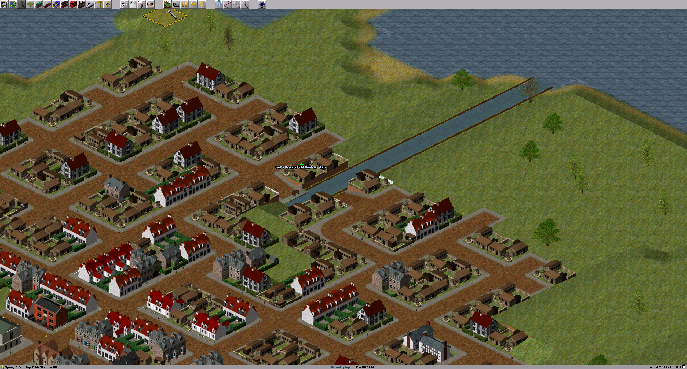
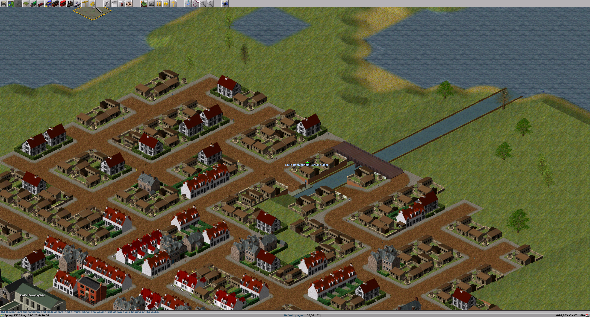

# simutrans-extended-bug-repro
save game and screenshots of tunnel bug to hopefully help reproduce the error

The bridge is built in Earl's Deaningfield as a low bridge over an active privately built canal.  I was able to reproduce once out of many runs by rerunning the save with no interaction for several minutes at fast speed.  

