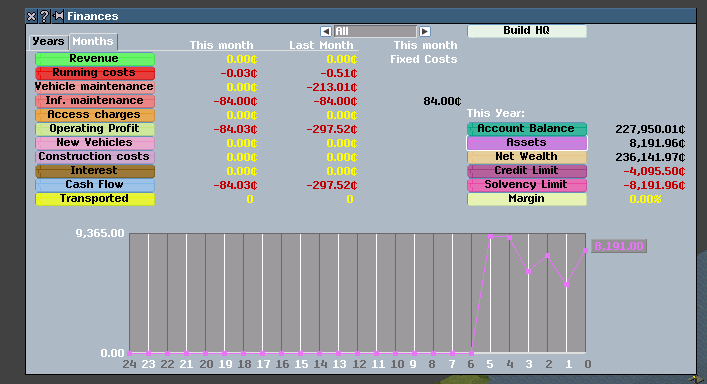

# simutrans-extended-bug-repro
save games and screenshots to demonstrate and reproduce bugs:

## Bugs:

* [Bridge built over canal](#bridge)
* [Asset Value Oscillations](#asset)

### <a name="bridge">Bridge built over active canal</a>
The bridge is built in Earl's Deaningfield as a low bridge over an active privately built canal.  I was able to reproduce once out of many runs by rerunning the save with no interaction for several minutes at fast speed.  It seems to be a rare event though, I've tried a number of times to reproduce and only done it once.  

[Save Game](https://github.com/whaleberg/simutrans-extended-bug-repro/blob/master/save%20before%20bridge%20construction.sve)

Before bridge:

After Bridge:

### <a name="asset">Asset Value Oscillating</a>

Asset values oscillate up and down in a wierd way.  They go up and down dramatically for several months and then eventually taper off into an even decreasing curve. 

To reproduce:

1. Start a new game in 1750.  (haven't tested other start years)
2. Immediately create a route with 1 vehicle.  
3. Start vehicle on route.
4.  Turn on fast motion
5.  Wait for a while

Example:

[Save Game](https://github.com/whaleberg/simutrans-extended-bug-repro/blob/master/assets%20oscillating.sve)

